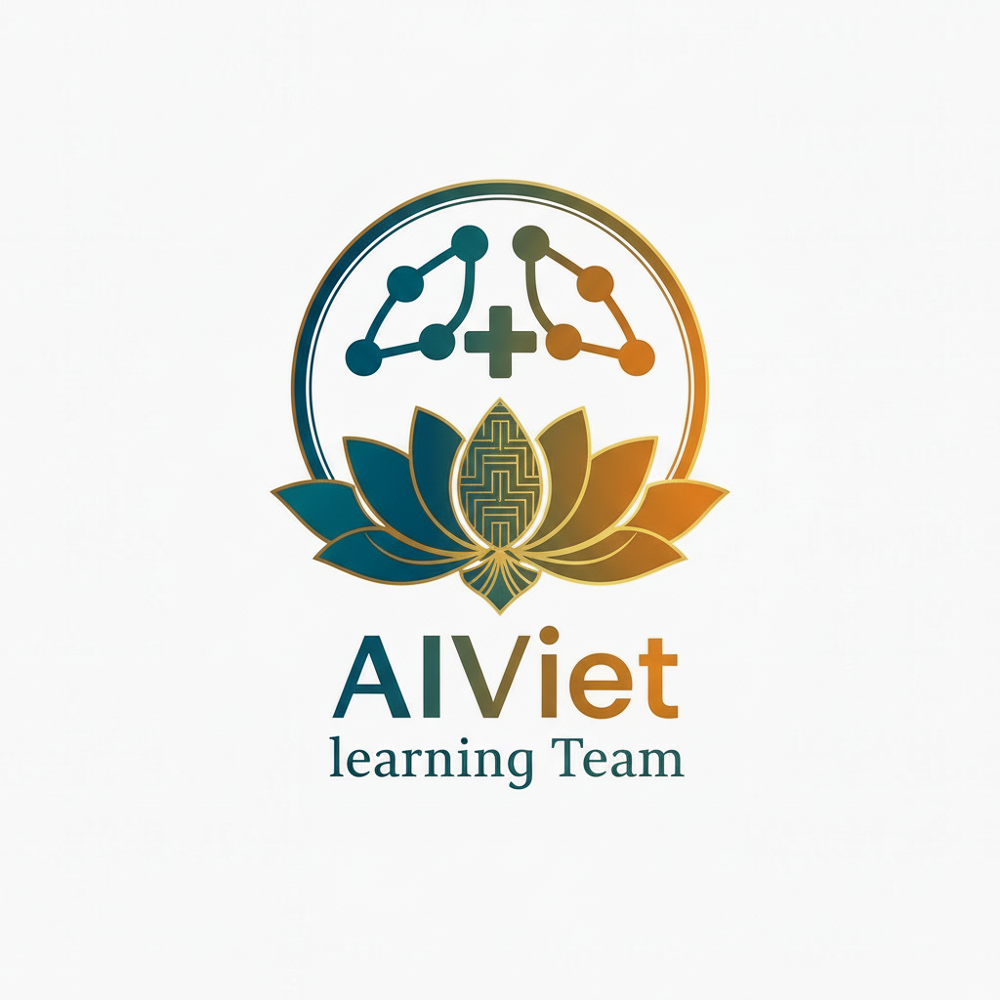

### HEART DISEASE DIAGNOSIS PROJECT — BLOG

—

### CHƯƠNG 1: GIỚI THIỆU DỰ ÁN

#### 1.1. Bối cảnh và động lực nghiên cứu

Bệnh tim mạch là nguyên nhân gây tử vong hàng đầu toàn cầu. Việc phát hiện sớm nguy cơ mắc bệnh tim giúp tối ưu can thiệp lối sống và điều trị. Với dữ liệu lâm sàng chuẩn hóa và các thuật toán học máy, ta có thể xây dựng hệ thống dự đoán rủi ro nhanh, nhất quán và dễ triển khai trên môi trường thực tế.

#### 1.2. Mục tiêu và phạm vi

- Xây dựng pipeline dự đoán bệnh tim từ dữ liệu lâm sàng chuẩn UCI Cleveland.
- Đánh giá và so sánh nhiều mô hình học máy (8+ mô hình), tối ưu siêu tham số.
- Tạo ứng dụng web thời gian thực (Streamlit) cho bác sĩ/người dùng trải nghiệm.
- Quản lý thực nghiệm có thể tái lập, lưu vết đầy đủ, xuất báo cáo.

Phạm vi bao gồm: tiền xử lý, chọn đặc trưng, huấn luyện/tinh chỉnh, đánh giá, giải thích mô hình, và triển khai prototype sản phẩm.

#### 1.3. Tổng quan giải pháp

- Dữ liệu: UCI Cleveland (303 mẫu, 13 đặc trưng). Tách train/val/test có kiểm soát seed.
- Pipeline: Preprocessing → Feature Engineering/Selection → Model → Evaluation.
- Quản lý thực nghiệm: theo dõi cấu hình, kết quả, và mô hình tốt nhất.
- Ứng dụng: Streamlit với 5 tab chức năng, dự đoán bởi 8 mô hình + Voting.

—

### CHƯƠNG 2: DỮ LIỆU & TIỀN XỬ LÝ

#### 2.1. Bộ dữ liệu UCI Cleveland Heart Disease (303 samples, 13 features)

- Nguồn: Tập Cleveland Heart Disease, chuẩn lâm sàng kinh điển trong nghiên cứu ML y khoa.
- Dung lượng: 303 dòng, 13 đặc trưng cốt lõi (tuổi, giới, huyết áp, cholesterol, đau ngực,...).
- Lưu trữ và biến thể dữ liệu tại: `data/` và `notebooks/splits/`.

#### 2.2. Phân tích khám phá dữ liệu (EDA)

- Kiểm tra phân phối biến, tương quan, giá trị thiếu/ngoại lai.
- Phát hiện đặc trưng có tín hiệu mạnh: ví dụ `cp` (chest pain), `thalach`, `oldpeak`... (minh họa trong báo cáo và biểu đồ).
- Hình ảnh/đồ thị tổng hợp: xem thư mục `results/figures/`.

#### 2.3. Data Preprocessing & Feature Engineering

- Chuẩn hóa, mã hóa biến phân loại (nếu cần), xử lý mất cân bằng (SMOTE ở một số biến thể dữ liệu).
- Tạo các tập đặc trưng: raw, feature-engineered (FE), FE+SMOTE, Boruta-selected (xem `data/processed/`).
- Lưu lại phiên bản dữ liệu để tái lập kết quả.

#### 2.4. Chia tập train/val/test

- Chiến lược tách rõ ràng: `raw_train.csv`, `raw_val.csv`, `raw_test.csv` (và các biến thể `fe_`, `dt_`, `master_boruta_`).
- Giữ seed cố định (=42) để đảm bảo khả năng tái lập.

—

### CHƯƠNG 3: PHƯƠNG PHÁP HỌC MÁY

#### 3.1. Tổng quan 8 mô hình sử dụng

- Linear: Logistic Regression
- Tree-based: Random Forest, Decision Tree
- Boosting: AdaBoost, Gradient Boosting
- Instance-based: KNN, Naive Bayes, SVM
- Ensemble: Voting Classifier (đa số phiếu)

Các mô hình tốt nhất được lưu ở `models/saved_models/` cùng bản tóm tắt `best_models_summary.json`.

#### 3.2. Tối ưu hyperparameters với Optuna

- Sử dụng Optuna để tìm siêu tham số tối ưu theo mục tiêu (ví dụ AUC/F1).
- Lưu log thử nghiệm và kết quả vào `experiments/` để đối chiếu.

#### 3.3. Pipeline xử lý (Preprocessing → Feature Selection → Model)

- Chuẩn hóa/biến đổi đầu vào → Chọn đặc trưng (MI/Boruta/FE) → Huấn luyện mô hình.
- Kiểm thử trên tập validation và khóa mô hình tốt nhất cho test.

—

### CHƯƠNG 4: QUẢN LÝ THỰC NGHIỆM

#### 4.1. ExperimentManager — Tracking system

- Ghi nhận cấu hình, siêu tham số, điểm số, đường dẫn mô hình/kết quả.
- Lưu `experiment_log.json`, `metadata.json` và dự đoán `.npy/.csv` trong `experiments/` và `results/artifacts/`.

#### 4.2. Reproducibility (Fixed seed = 42)

- Cố định seed trong các bước tách dữ liệu, mô hình và sampling.
- Cho phép tái lập kết quả trên nhiều môi trường/hệ thống khác nhau.

#### 4.3. Cross-validation & Metrics

- Sử dụng validation/cross-validation khi tinh chỉnh.
- Thước đo chính: AUC, F1-score, Accuracy; kèm Confusion Matrix.

—

### CHƯƠNG 5: KẾT QUẢ & ĐÁNH GIÁ

#### 5.1. Bảng so sánh 8 mô hình (Test AUC: 0.856 → 0.947)

- Kết quả tổng hợp hiển thị trong `results/` (các file `.csv`) và biểu đồ ở `results/figures/`.
- Một số hệ boosting và ensemble đạt AUC nổi trội trên tập test, cải thiện từ ~0.856 lên ~0.947 tùy cấu hình dữ liệu/đặc trưng.

#### 5.2. Feature Importance Analysis

- Phân tích tầm quan trọng đặc trưng đối với các mô hình tree/boosting.
- Quan sát các đặc trưng lâm sàng mang tính dự báo cao; hỗ trợ diễn giải mô hình.

#### 5.3. Confusion Matrix & Model Performance

- Trình bày ma trận nhầm lẫn, Precision/Recall/F1 cho từng mô hình.
- Đánh giá cân bằng giữa Sensitivity (Recall dương tính) và Specificity.

#### 5.4. Ensemble Voting Results

- Voting Classifier giúp ổn định dự đoán bằng cách kết hợp nhiều mô hình tốt.
- Cải thiện nhẹ độ bền và hiệu năng tổng thể trong một số cấu hình.

—

### CHƯƠNG 6: ỨNG DỤNG WEB & TRIỂN KHAI

#### 6.1. Giao diện Streamlit (5 tabs chức năng)

- Ứng dụng chính tại `app/app.py` và `improved_app.py` với giao diện thân thiện.
- 5 tab: Nhập dữ liệu, Chọn mô hình, Dự đoán, Giải thích, Lịch sử/Báo cáo.

#### 6.2. Hệ thống dự đoán thời gian thực (8 models + Majority Voting)

- Tải và suy luận với các mô hình đã huấn luyện trong `models/saved_models/`.
- Hỗ trợ chế độ bỏ phiếu đa số để tăng ổn định.

#### 6.3. Model Interpretability & Visualization

- Trình bày tầm quan trọng đặc trưng, đường cong ROC, và biểu đồ hiệu năng.
- Hình ảnh minh họa tại `results/figures/`.

#### 6.4. Quản lý lịch sử & Export PDF Reports

- Lưu lịch sử dự đoán (ví dụ `data/patient_history.json`).
- Hỗ trợ xuất kết quả/báo cáo để chia sẻ.

#### 6.5. Deployment lên Streamlit Cloud

- Script triển khai: `DEPLOYMENT.md`, `run_app.sh`, `setup_deployment.sh`.
- Yêu cầu môi trường ghi trong `requirements.txt`, `packages.txt`.

—

### CHƯƠNG 7: KẾT LUẬN & HƯỚNG PHÁT TRIỂN

#### 7.1. Thành tựu chính (AUC ≈ 0.92, production‑ready app)

- Đạt hiệu năng tốt (AUC trung bình khoảng ~0.92 trên các cấu hình tối ưu).
- Xây dựng ứng dụng web sẵn sàng triển khai, pipeline tái lập, kết quả minh bạch.

#### 7.2. Hạn chế & Bài học

- Kích thước dữ liệu gốc nhỏ (303 mẫu) → Nguy cơ overfitting, cần thẩm định ngoài.
- Chất lượng nhãn/đặc trưng ảnh hưởng mạnh đến ổn định mô hình.
- Bài học: cần chuẩn hóa quy trình, theo dõi thực nghiệm và kiểm định độc lập.

#### 7.3. Hướng cải tiến

- Bổ sung SHAP values cho diễn giải cá nhân hóa.
- External validation trên cohort khác để xác nhận khả năng tổng quát hóa.
- Cung cấp REST API cho tích hợp hệ thống lâm sàng.

#### 7.4. Tài liệu tham khảo & Code repository

- Tài liệu, hình ảnh và kết quả: thư mục `docs/`, `results/figures/`, `results/`.
- Hướng dẫn triển khai: `DEPLOYMENT.md`, `README.md`.
- Mã nguồn: xem cấu trúc tại thư mục gốc dự án và `models/`, `experiments/`.

—

Gợi ý trải nghiệm nhanh:

- Chạy ứng dụng: tham khảo `README.md` hoặc `run_app.sh`.
- Khám phá so sánh mô hình: mở các biểu đồ trong `results/figures/`.
